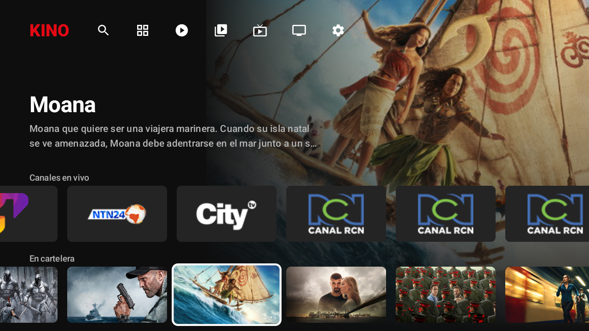
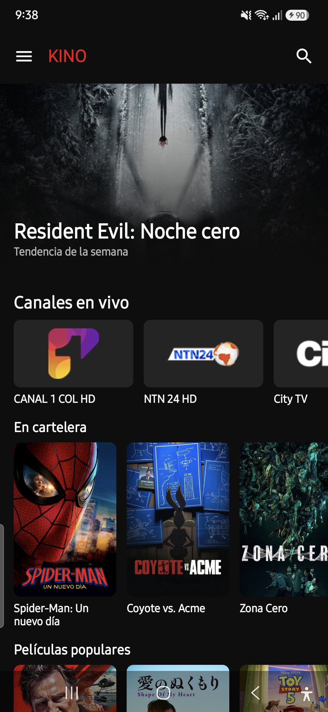
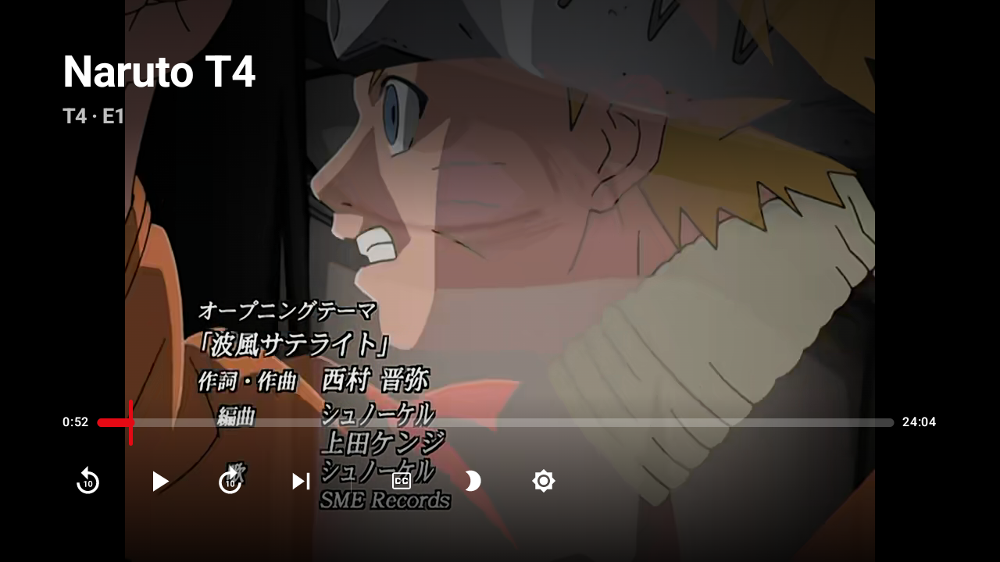
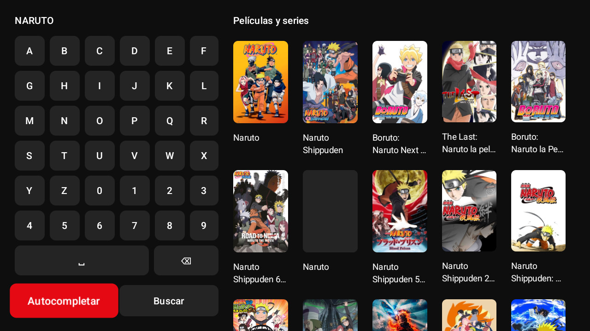
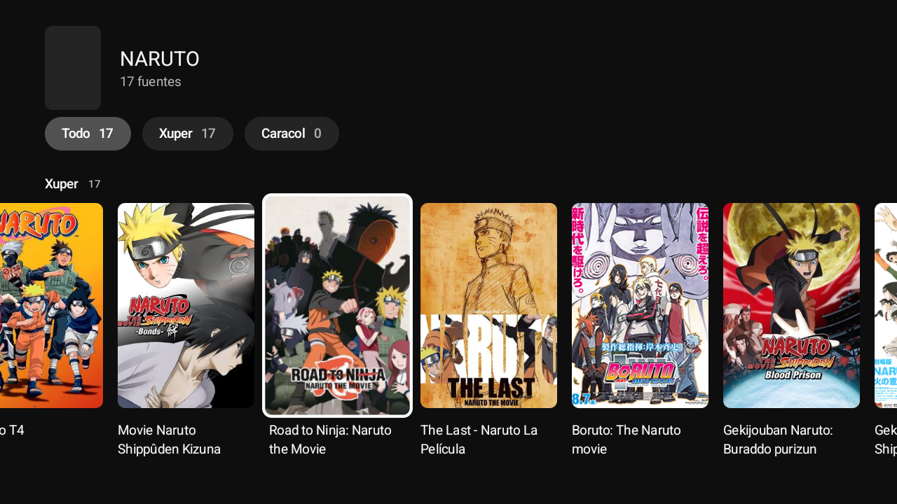
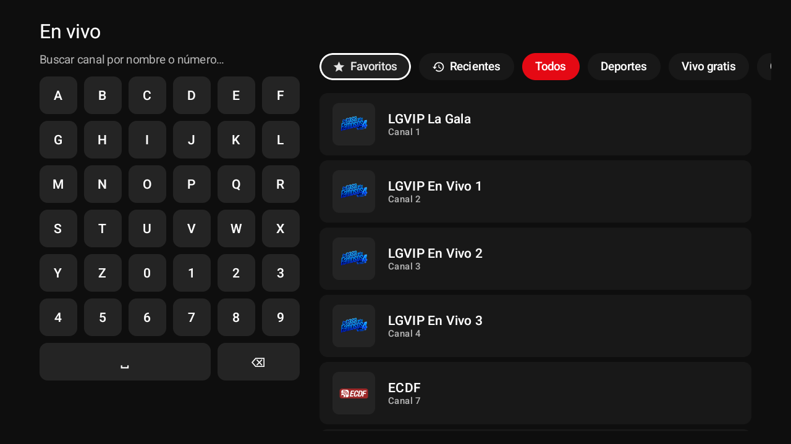
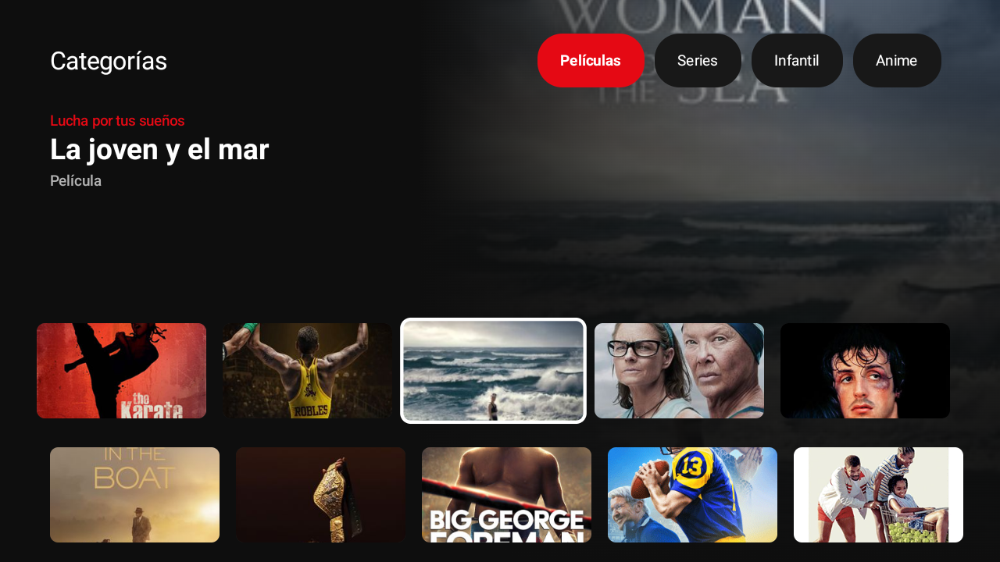
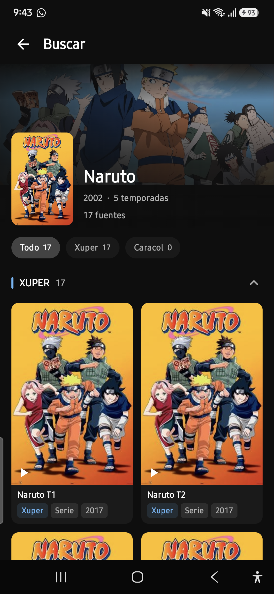
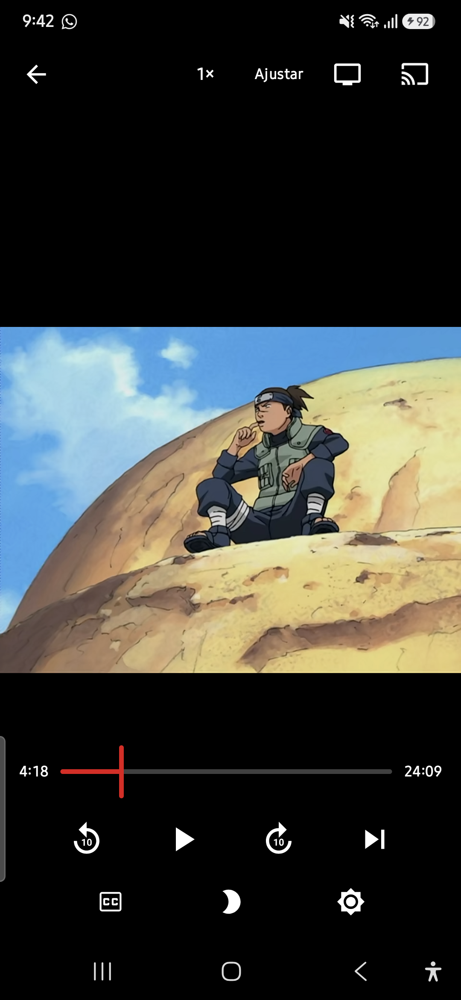

# Kino

Kino es la app para ver películas y series en el celular y en el televisor (Android TV / Fire TV).
Es el mismo APK para los dos: se instala igual en cualquiera de los dos aparatos, y él solo se
acomoda a una pantalla grande con control remoto o a una pantalla de celular con los dedos, con el
mismo catálogo y la misma cuenta en ambos.

## Descargar

**[Descargar el APK más reciente](https://github.com/lordmacu/kino-light/releases/latest/download/app-release.apk)**

También puedes ver todas las versiones en la [página de releases](https://github.com/lordmacu/kino-light/releases).

  
  

## Sin virus, sin publicidad y sin rastreadores

Kino solo habla con los servidores necesarios para traer las películas, las series y el catálogo:
ni un byte más. No trae ningún rastreador que reporte lo que ves o cómo usas el celular, no muestra
publicidad de ningún tipo, y no instala nada aparte de la app misma. Todo lo que se instala en el
aparato es exactamente lo que ves en este repositorio, a la vista de cualquiera.

## Qué puedes hacer con Kino

- **Ver películas y series**, con póster, sinopsis y todo el catálogo de temporadas y capítulos
  ordenado.
- **Canales en vivo**, incluyendo la señal de Caracol y otros canales colombianos.
- **Caracol gratis**: películas y series de Caracol Streaming, sin necesitar una cuenta.
- **Buscar** cualquier título y encontrarlo entre todas las fuentes a la vez.
- **Categorías**, para explorar por género en vez de buscar por nombre.
- **Mi biblioteca**: guarda lo que te interesa para encontrarlo rápido después, y la app avisa
  cuando sale un capítulo nuevo de algo que ya guardaste.
- **Continuar viendo**: la app recuerda en qué minuto ibas de cada capítulo, en cualquiera de tus
  aparatos.
- **Descargar** películas y capítulos al aparato, para verlos sin necesitar internet.
- **Chromecast**: manda lo que estás viendo a un Chromecast o a un televisor compatible, y sigue
  controlando la reproducción desde el celular.
- **Subtítulos**, con el idioma que prefieras guardado para la próxima vez.
- **Recomendaciones para ti**, según lo que ya viste.
- Una sección de anime, y un dato curioso de cada título mientras decides si verlo.

## Cuenta de Xuper

Algunas películas, series y todo el contenido en vivo necesitan una cuenta de Xuper vinculada.
Desde la propia app puedes:

- **Iniciar sesión** si ya tienes una cuenta de Xuper.
- **Crear una cuenta nueva** sin salir de Kino: solo pides el código que te llega al correo y
  confirmas.
- O **omitir esto por ahora** y seguir viendo el resto del catálogo sin cuenta; puedes vincularla
  más adelante desde Ajustes cuando quieras.

Usar contenido de terceros como Xuper es responsabilidad de quien activa la cuenta: Kino no
promueve la piratería, solo facilita el acceso a lo que cada quien decida ver.

## Cómo nació Kino

La app original de Xuper trae, además del catálogo, publicidad, rastreadores y programas de fondo
que no tienen nada que ver con ver una película. Kino nace de estudiar cómo esa app habla con los
servidores de Xuper y reconstruir esa misma conexión desde cero, en una app propia: el mismo
catálogo y los mismos servidores de siempre, pero sin nada de lo que la app original traía de más.

## En el televisor

La versión de TV tiene su propio diseño, pensado para verse y manejarse con el control remoto
desde el sofá: control por flechas, foco grande y legible, y las mismas funciones que en el
celular.

  
  

  
  

  
  

## En el celular

  
  
  
  

## Novedades recientes

- Se mejoró la pantalla de activación en el televisor: el texto ahora se ve con buen contraste, y
  se agregó un botón para cerrarla sin activar nada.
- Se agregó, en el texto de la activación, una aclaración sobre el uso responsable del contenido de
  terceros.
- Se corrigió un salto raro en la pantalla de inicio del televisor: antes, mientras cargaban los
  canales en vivo, la pantalla se desplazaba sola y tapaba el principio del catálogo.
- Volvió la opción de **crear una cuenta de Xuper desde la app**, sin necesitar nada aparte de Kino.
- Se renombró "Magis" a "Xuper" en toda la app, para que el nombre sea consistente en todas las
  pantallas.
